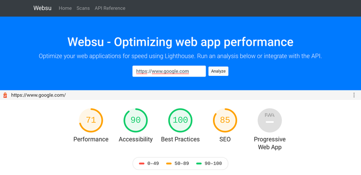

[](https://websu.io)
# Websu - Web speed analysis

[Websu](https://websu.io) helps you understand your web applications performance.
[Lighthouse](https://github.com/GoogleChrome/lighthouse) is used to generate performance reports.
Websu is providing Lighthouse-as-a-Service
through a simple HTTP REST API to run Lighthouse. The react based frontend
[Websu UI](https://github.com/websu-io/websu-ui) consumes the Websu HTTP API.

## Features
- Run lighthouse-as-a-service through a simple HTTP REST API
- Retrieve a list of previous results
- Web UI to host your own internal Lighthouse service
- Ability to compare results (TODO)

## Trying it out
You have 2 options:
1. Use the public demo instance available here: [https://websu.io](https://websu.io)
2. Deploy Websu in your own environment. See for example Deployment using Docker below.

## Deployment using Docker (easiest)
Deploy the docker image in your environment by running the following:
```bash
git clone https://github.com/websu-io/websu
cd websu
docker-compose up -d
```
The docker-compose will bring up the Websu container and a mongoDB container.
The Websu containers runs the websu API and the static frontend web UI with
it. After deployment you can access Websu UI by visiting http://IP:8000

You can test the API by running the following:
```
curl -d '{"url": "https://www.google.com"}' localhost:8000/reports
```

## Deployment using Google Cloud Run managed (harder, better, faster)
Cloud Run is a great cost efficient option to deploy a production ready
instance of Websu. Cloud Run takes care of automatically scaling and launching
Lighthouse jobs. In addition the free limits of Cloud Run managed are very
generous. The public [https://websu.io](https://websu.io) instance is running
on Cloud Run.

Push the images to Google Cloud Artifact Registry:
```
export PROJECT_ID=$(gcloud config get-value project)
gcloud artifacts repositories create websu --repository-format=docker \
  --location=us-central1 --description="Websu Docker repository"
gcloud auth configure-docker us-central1-docker.pkg.dev
docker pull samos123/lighthouse-server:latest
docker tag samos123/lighthouse-server:latest us-central1-docker.pkg.dev/$PROJECT_ID/websu/lighthouse-server:latest
docker push us-central1-docker.pkg.dev/$PROJECT_ID/websu/lighthouse-server:latest
docker pull samos123/websu-api:latest
docker tag samos123/websu-api:latest us-central1-docker.pkg.dev/$PROJECT_ID/websu/websu-api:latest
docker push us-central1-docker.pkg.dev/$PROJECT_ID/websu/websu-api:latest
```

Deploy lighthouse-server on Cloud Run:
```
gcloud run deploy lighthouse-server \
  --image us-central1-docker.pkg.dev/$PROJECT_ID/websu/lighthouse-server:latest \
  --memory 512Mi --platform managed --port 50051 --timeout 60s --concurrency 1 \
  --region us-central1 --set-env-vars="USE_DOCKER=false" --allow-unauthenticated
```

Deploy websu-api on Cloud Run:
```
ENDPOINT=$(\
  gcloud run services list \
  --project=${PROJECT_ID} \
  --region=us-central1 \
  --platform=managed \
  --format="value(status.address.url)" \
  --filter="metadata.name=lighthouse-server")
ENDPOINT=${ENDPOINT#https://}:443

gcloud run deploy websu-api \
  --image us-central1-docker.pkg.dev/$PROJECT_ID/websu/websu-api:latest \
  --platform managed --port 8000 --timeout 60s --region us-central1 \
  --set-env-vars="MONGO_URI=mongodb://ip-of-your-mongo-db-instance,LIGHTHOUSE_SERVER=$ENDPOINT,LIGHTHOUSE_SERVER_SECURE=true" \
  --allow-unauthenticated
```

## FAQ
- **Why not just use Lighthouse directly?**
    - Lighthouse provides a CLI and an extension that can be installed in
      Chrome. Lighthouse doesn't provide an HTTP API or a Web UI. Websu makes
      it easier to consume Lighthouse for both standard users and web
      developers with an HTTP API and a Web UI. It also allows you to
      store the results of runs so you can compare and view them at a
      later time.


## Developer instructions

Regenerate gRPC golang client and server code
```
cd pkg/lighthouse
protoc --go_out=. --go_opt=paths=source_relative \
  --go-grpc_out=. --go-grpc_opt=paths=source_relative \
  lighthouse.proto
cd -
```

Generate updated API documentation:
```
swag init -g cmd/websu-api/main.go
```

## License
[](https://opensource.org/licenses/Apache-2.0)
